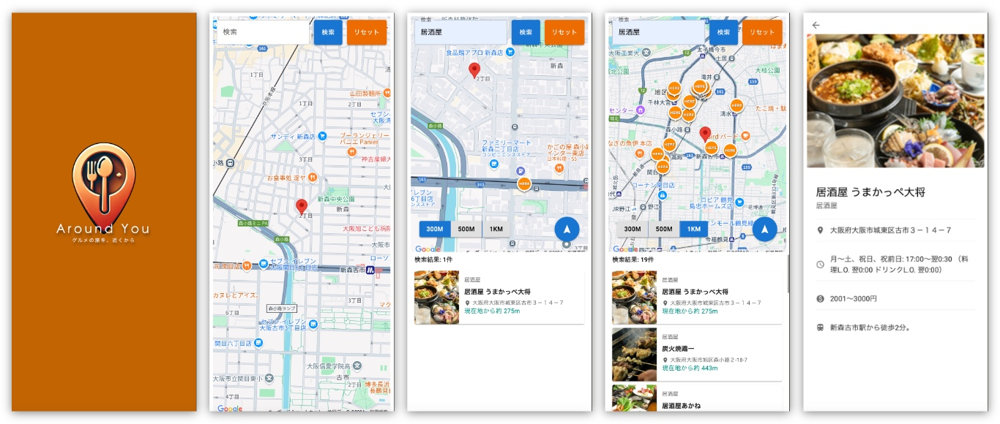

# 簡易仕様書

## アプリ名
Around You | グルメの旅を、近くから 

## コンセプト
友達とご飯の時にお店選びで迷いたくない。  
パートナーとの食事でバシッと決めたい。  
美味しい出会いは日常を豊かに。  
Around Youはあなたの生活とデリシャスを応援します。 

## 対象OSおよびブラウザ(ver.含む)
対象OS: Windows 10 / 11, macOS  
主要ブラウザ: Google Chrome, Microsoft Edge, Safari, Firefox, Sleipnir 

## 開発環境/言語
### フロントエンド環境
#### ビルドツール
・**Vite:** v6.0.0  

#### 使用言語
・**TypeScript:** v5.6.2

#### フレームワーク
・**React:** v18.3.1

#### ライブラリ
・**React Router DOM:** v7.0.1  
・**Redux Toolkit:** v2.3.0    
・**Axios:** v1.7.8   
・**@mui/material:** v6.1.8   
・**react-google-maps/api:** v2.20.3  
・**React Geolocated:** v4.2.0  

#### 開発補助ツール
・**ESLint:** v9.15.0  
・**Prettier:** v3.4.1  
・**@typescript-eslint/eslint-plugin:** v8.16.0  
・**@typescript-eslint/parser:** v8.16.0  
・**vitejs/plugin-react:** v4.3.4  
 

### バックエンド環境
#### ランタイム環境
・**Node.js:**

#### 使用言語
・**TypeScript:** v5.7.2

#### フレームワーク
・**Express:** v4.21.1

#### ライブラリ
・**CORS:** v2.8.5    
・**Axios:** v1.7.8   
・**dotenv:** v16.4.5   

#### 開発補助ツール
・**ts-node:** v10.9.2  
・**@types/express:** v5.0.0  
・**@types/cors:** v2.8.17  
・**@types/node:** v22.10.1  
 

## 機能概要(機能一覧)

 
### 検索条件入力画面
・スプラッシュスクリーン。  

・Geolocation APIを使って現在地を取得。  

・現座地からの検索半径を指定できる。(300m / 500m / 1km)  

・画面上にGoogle Mapを表示。 

・検索決定ボタン。  

・検索内容リセットボタン。  

### 検索結果画面
・一覧形式で店舗を画面に表示。  

・各店舗はカードデザインでリスト表示され、「店舗画像」「店舗カテゴリ」「店舗名称」「アクセス」「現在地からの距離」が表示される。    

・現在地と検索でヒットした店舗をマップ上でマーカー表示。  

・検索範囲内にある店舗数の合計を「検索結果: 〇〇件」と表示。 ※最大100件まで  

・ページングに対応。(10件ごとに) ※最大10ページ  

・MAP上に表されたマーカーがクリックされた際、クリックされたマーカーを拡大表示。また、クリックされたマーカーの店舗情報までリストからページ遷移 ※ページングに対応  
・現在地に戻るボタン。

・300m、500m、1kmのボタンがクリックされた際、自動的に画面をズームイン/ズームアウト。  

### 店舗詳細画面
・検索結果画面のリストから選択された店舗の「店舗画像」「店舗名称」「店舗カテゴリ」「アクセス」「営業時間」「予算」「最寄駅」を表示。  

・検索条件入力画面に戻るボタン。また、戻るボタンから戻った際に、直前の検索内容を保持 

### 申し送り事項
・店舗詳細画面から直前の検索内容を保持した状態で検索画面に戻る際、スプラッシュスクリーンを非表示にできなかった。※対処可能  

・検索範囲の直径をマップ上に表示できなかった。※対処可能  

・現在地を取得できなかった際、東京駅の座標で表示。※対処可能

・検索結果画面の店舗リストを金額ごとに並び替えを導入 ※対応可能
 

## 開発期間
2週間 

## こだわったポイント
1. **コンセプトに基づいたUXの設計:**  
  「友達とご飯の時にお店選びで迷いたくない」「パートナーとの食事でバシッと決めたい」「美味しい出会いが人々の日常を豊かにする」というコンセプトを出発点に、ユーザーが素早く、かつ直感的に再定期な店に辿りつけるような体験を重視しました。

2. **直感的なUX:**  
  Geolocation APIを用いて現在地を取得し、検索半径をユーザーがすぐに行きやすい範囲である300m、500m、1km内で検索できる仕組みによって「近くて美味しいお店」にすぐアクセス可能なUXを意識しました。また、現在地から店舗までの距離を表示することで、視覚的にも店舗への距離がわかりやすくなるようにしました。

3. **地図との連動による情報の可視化:**  
  Google Mapとの連携で、検索結果を視覚的に把握できるようにしました。

4. **状態保持によるスムーズな画面間移動:**  
  詳細画面から検索画面に戻る際、直前の検索条件や結果を保持することで、再度条件を入力し直す手間を省きました。 

## デザイン面でこだわったポイント
・Material UIを用いて、モダンで統一感のあるコンポーネントデザインを実現しました。押しやすいボタンや視認性の高いカードレイアウトなど、操作性を重視しています。

・食欲を刺激し、温かみのある印象を与える「暖色系」のオレンジをキーカラーに採用しました。

・アクセスや予算などでアイコンを配置し、情報を直感的に理解していただけるように意識しました。

## アドバイスして欲しいポイント
### デザイン面
今回、メインカラーとして「食欲をそそるオレンジ」を選定しましたが、同じオレンジ系でも彩度や明度のわずかな違いで印象が変わると考えています。  
また、サブカラーや背景色との組み合わせ方によっても全体の雰囲気が大きく左右されると思うのですが、こうした色選びや配色のバランスを決める際には、どのような基準やプロセスで検討を進めればよいのでしょうか。

### エンジニアリング面
学内開発や個人開発で、小さな機能単位や画面単位でこまめにコミットすることが理想なのですが、実際の開発時、完成間近で一気にコミットしてしまうことが多く、変更点が膨大になってしまうことが課題です。  
そのため、エンジニアの視点から、以下のような点についてアドバイスを頂きたいです。  

・コンポーネント単位の機能追加ごとにコミットする習慣のつけ方。  

・バグ修正やスタイル微調整など、小さな変更でもこまめにコミットするタイミングの目安。

・ブランチやプルリクエストの活用方法。

## 自己評価
### 継続すること(Keep)
・**コンセプト設計からの開発:**  
「友達とのご飯で迷いたくない」「パートナーとの食事でバシッと決めたい」などのコンセプトを明確にし、UXや機能設計を行えた。

・**小さなUX改善の積み重ね:**  
店舗表示やページングなど、要件を満たした上で、よりユーザーがスムーズに操作できるよう改善を続けられたが良かった。

・**Material UI（MUI）の初挑戦と活用:**  
MUIを初めて使用し、コンポーネント設計時に活用することで、短期間で統一感のあるデザインを実現できた。

・**Viteを用いたビルド環境構築:**  
高速なビルドツールであるViteを導入し、効率的な開発・ビルドサイクルを実現できた。

・**PrettierやESLintなどの開発補助ツール活用:**  
コードスタイルや品質を保つツールを利用し、保守性・可読性の高いコードベースを維持できた。

### 問題点・課題(Problem)
・**コミットの頻度と偏り:**  
機能追加を一気に仕上げた後でまとめてコミットしてしまい、変更点が大きくなりレビューしづらくなった。

・**マップ関連機能の一部未実装:**  
検索範囲の円表示など、UI上で表現したかったが時間内に対処できず申し送りになってしまった。

### 次に挑戦すること・改善策(Try)
・**こまめなコミットの習慣化:**  
機能単位、画面単位、あるいはUI改善ごとなど、小さな区切りでコミットするルールを自分なりに定め、実行したい。

・**追加機能の段階的な実装:**  
マップ上への検索範囲可視化など、今後は最小機能から段階的に拡張することで、後からでも対処しやすい実装プロセスを目指したい。

